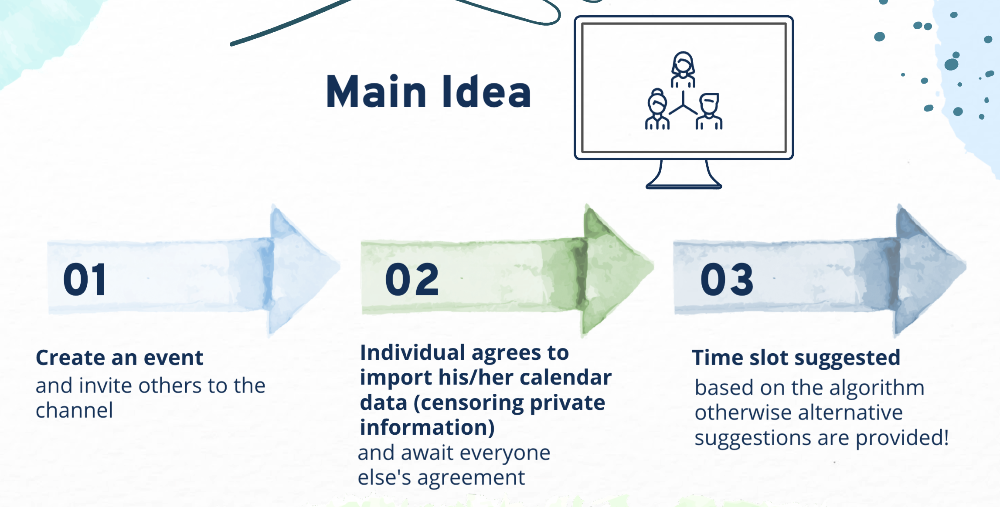

# RSVPlus Web App

## Deployed Website

<https://rsvplus.vercel.app/>

## Video Introduction (Quick Walkthrough of Features)

<https://www.youtube.com/watch?v=Hb3KAmThD3o&ab_channel=NUSOrbital>

## Purpose

RSVPlus is a calendar web application that suggests optimal time slots based on everyone's Google Calendar availability.

## Motivation

Have you ever had to work as a team to complete a project for one of your modules, and you experience difficulty deciding on the optimal meeting time that works for all members? Most of the time, team members resort to using Telegram polls to decide on a common date and time where the majority are free.

The downside, however, is that a Telegram poll is restrictive with its limited parameters since it does not display all the available time slots for everyone. With lots of messages being sent and received, it is difficult to concurrently keep track of responses in the poll. In general, organizing events manually (via Telegram poll or any other poll-based service) can be a time-consuming task and chaotic experience for many.

This should sound familiar to everyone, because it has definitely happened to us. This got us thinking: is there a way to optimise the process of organizing a meetup? What if there is a way to analyse your calendar as well as your teammates’ calendars and instantaneously decide on a date that everyone is free without having to read any messages in your Telegram/Whatsapp groups?

## Aim

Through this project, we **aim to bring convenience and accessibility to everyone, such as friend groups, co-curricular activity groups or even project teams** when it comes to organizing meetups. With an all-in-one integrated application and algorithm to suggest optimal timeslot(s) for everyone, it offers efficiency and connectivity when organizing meetups, while at the same time making the process much more simplified.

## How it works

## Breakdown of Features
<https://www.figma.com/file/zI65CDPZoYCcvUK7Bw4GuZ/RSVPlus-Milestone-2?node-id=0%3A1>

## User Stories

| As a …​ | I want to …​                                                                                  | So that I can…​                                                                                 |
| ------- | --------------------------------------------------------------------------------------------- | ----------------------------------------------------------------------------------------------- |
| host    | be able to create a channel                                                                   | organize events or meetups and invite others.                                                   |
| host    | be able to input a date range (start date to end date) when creating a channel                | obtain optimal time slots for those dates specified.                                            |
| host    | be able to input a time range to look out from (e.g 10AM - 4PM) when creating a channel       | only find slots available for those timings specified.                                          |
| host    | be able to input emails when creating the channel                                             | invite others to the channel.                                                                   |
| host    | be able to remove a channel after finding optimal slots or if the channel contains errors     | reduce clutter or create a new one afterwards.                                                  |
| host    | be able to add a user to the invited list even after creating the channel                     | invite another person if I forgot to invite that person.                                        |
| host    | be able to remove a user from the channel                                                     | prevent people who take too long to respond from hogging the channel.                           |
| user    | be able to fetch my future Google Events upon logging in                                      | know which urgent events are coming up soon.                                                    |
| user    | be able to view the specific date and time of the future events fetched                       | to know every exact detail.                                                                     |
| user    | be able to create my own channel                                                              | be a host and invite others as well.                                                            |
| user    | be able to view channels that I am only in                                                    | reduce clutter and not see unrelated channels unrelated to me.                                  |
| user    | be able to leave a channel                                                                    | not to be part of the channel or should it serve no purpose anymore.                            |
| user    | be able to join a channel using the channel ID provided by the host                           | manually join a channel myself and not only wait for the host to invite me.                     |
| user    | be able to view the optimal slots found for the event of the channel for the respective dates | be aware of the best available time slots for everyone.                                         |
| user    | be able to refresh the optimal slots for the event of the channel                             | update the optimal time slots of the channel if I have modified my Google Calendar data.        |
| user    | be able to view my own Google calendar within the app                                         | see any upcoming events or event details from an overview perspective.                          |
| user    | be able to create an event for Google Calendar within the app                                 | add the event directly to Google Calendar for convenience or after an event has been confirmed. |
| user    | be able to view a FAQ section                                                                 | understand the purpose of the application.                                                      |
| user    | be able to give feedback to the developers                                                    | provide any suggestions or ask questions if necessary.                                          |

## Tabs and their respective features [[User Guide](https://www.figma.com/file/zI65CDPZoYCcvUK7Bw4GuZ/RSVPlus-Milestone-2?node-id=0%3A1)]

### Home Tab

- Fetch upcoming (future) events from Google Calendar and display their details by earliest date to end date with their timings for urgency. (No data stored here)

### Channels Tab

- Allow a user to be the host and create a channel to invite people to.

  - Input boxes to type in the basic details of the event of the channel .
  - A date picker to select the date range conveniently that the algorithm will use.
  - A time picker to select the start time and end time of time range for the timeslots the algorithm will find.
  - A scalable invite list (1 to 9) that checks against RSVP+ database if the invited users are users of RSVP+.

- Upon creation of the channel with the invited parties, it prompts a "Agree to Sync Calendar Data" button that appears for all users.

  - The button prompts all users to click and agree to sync their calendar data for the specified date range and timing (while censoring private information).
  - Fetches their Google Events that falls within the date range of the channel they're syncing to
  - Extracts the busy dates with the busy timings of each date and stores them in our database and syncs it over to update the channel's data.
  - Upon everyone's agreement (all have responded), the algorithm runs and broadcasts to the group the most optimal time slots for each respective date if time slots exist.

- Allow a host to modify the invites of a channel (Remove/ add a user).

  - If the host has forgotten to invite someone.
  - If a user is taking too long to respond, hogging the channel.
  - If a user is unable to make it, the host can remove the user and the optimal slots will be re-determined automatically without that user's data.

- Allow a host to delete the channel. (Event is cancelled/ date and time have been decided on)

- Allow a user to join a channel with just the channel ID.

- Allow a user to update the channel's optimal slots by clicking the "Refresh" button after he/she has modified her Google Calendar data.

  - Clears user's previous synced data.
  - Updates channel with newly synced data.

- Allow a user to leave the channel if he/ she rejects the invitation or is unable to make it anymore. (if user has responded but left channel, the channel will automatically redetermine the optimal time slots without that user's data)

### Calendar Tab

- Allow users to create their own Google Calendar event and add it to their Google Calendar.
- Provides the convenience of adding an event once an event has been confirmed after deciding on the optimal date and time slot.

- Allow users to see their own google calendar within the website.

### FAQ Tab

- Users can learn more about RSVPlus’ design and its purpose.

- Teach unsure users how to use RSVPlus’ features.

### Contact us Tab

- Users can submit any feedback or advice that they may have when using RSVP+.

- Administrators can use the information given by users to optimise the back-end and front-end of RSVP+.

## UML Diagrams (User Flow)

### Dashboard

[Link](https://www.figma.com/file/mwRBM5YLaqtIZsd3LLiT4O/Untitled?node-id=0%3A1)

### Calendar

[Link](https://www.figma.com/file/mwRBM5YLaqtIZsd3LLiT4O/Untitled?node-id=4%3A47)

### Channels

[Link](https://www.figma.com/file/mwRBM5YLaqtIZsd3LLiT4O/Untitled?node-id=8%3A32)

## Techstack

Javascript, React, Firebase, HTML & CSS
